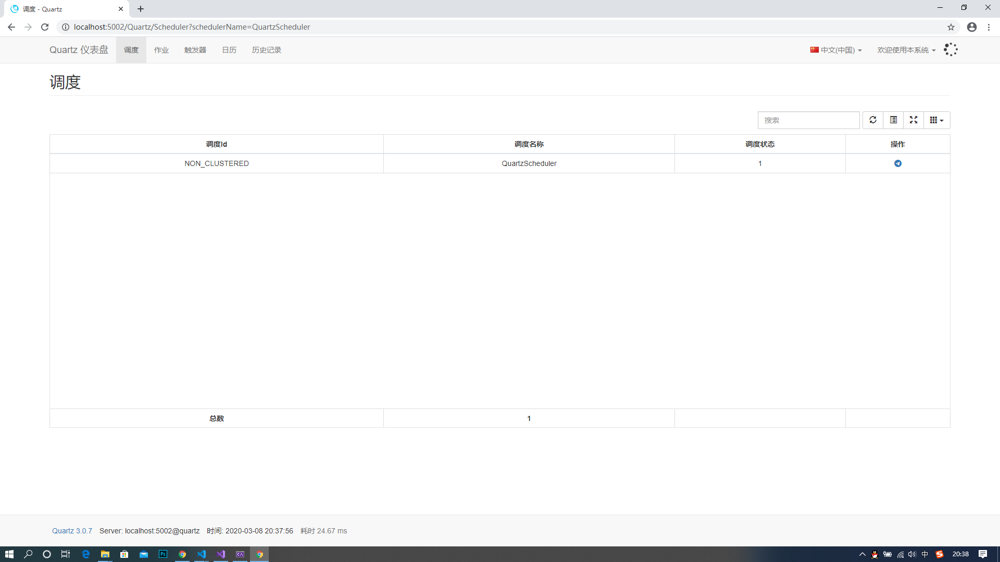
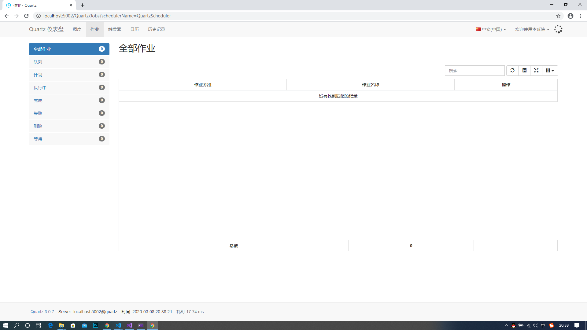
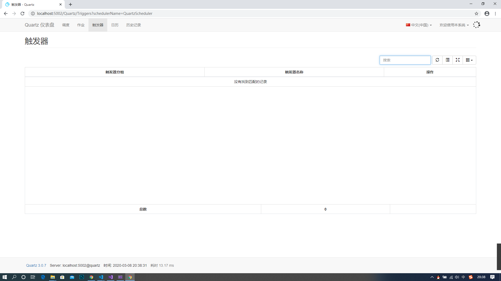
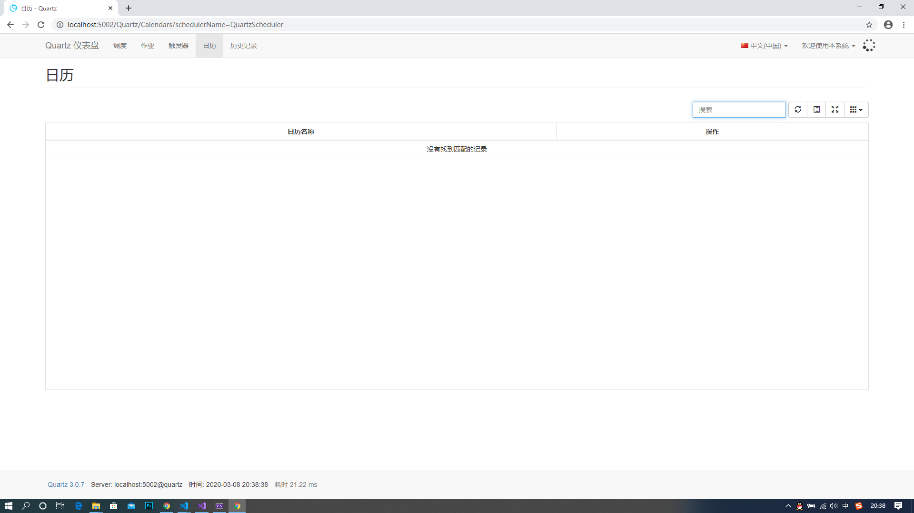
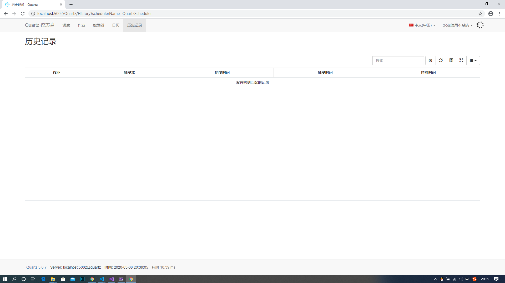
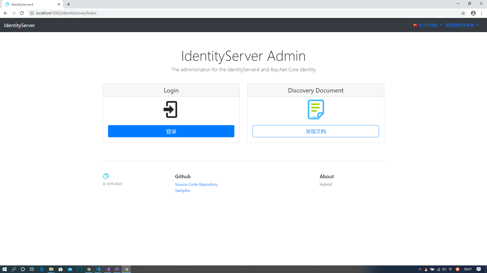
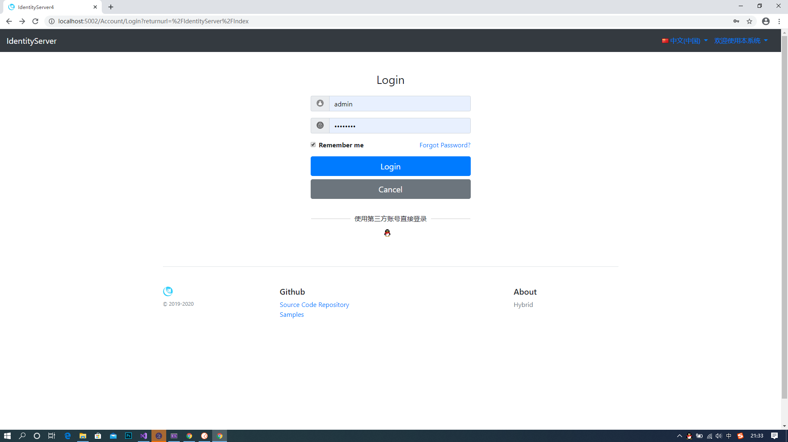
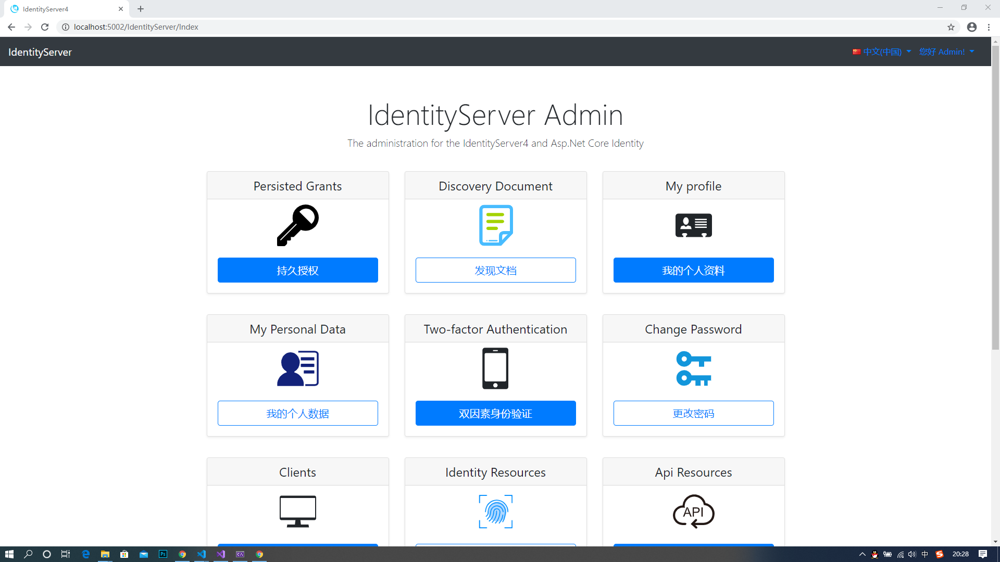
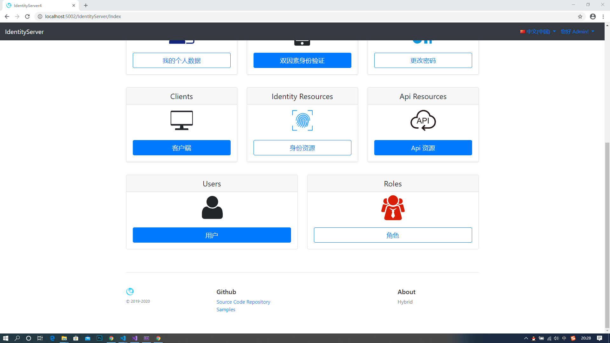

# Hybrid

## Project Status

## Administration UI Preview

- Quartz UI

- IdentityServer UI

## Plan

- 设计一个Logo

# 说明
### ①参考<a href="https://github.com/aspnetboilerplate/aspnetboilerplate" target="_blank">ABP</a>
### ②参考<a href="https://github.com/i66soft/osharp" target="_blank">Osharp</a>
### ③参考<a href="https://github.com/tanmingchao/esoftor-master" target="_blank">Esoftor</a>
### 二零二零年一月十九号正式开源

## 特点
### 引入泛型控制器
### Quartz仪表板
### IdentityServer管理后台
### Identity管理后台(待集成)
### 阶梯算法

> ClaimTypes【Hybrid】

> Hybrid.AssemblyInfo

> Hybrid.AspNetCore.AssemblyInfo

